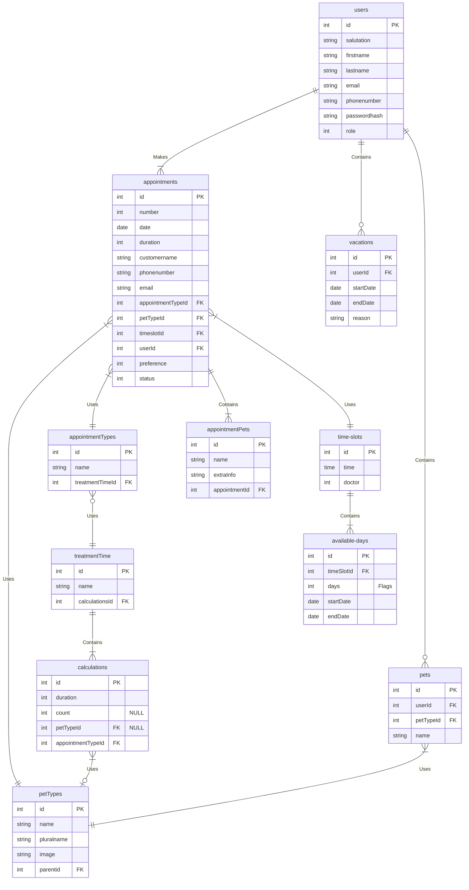

```mermaid
erDiagram
    appointments }|--|| petTypes : Uses
    appointments }|--|| appointmentTypes : Uses
    appointments ||--|{ appointmentPets : Contains
    appointments }|--|| time-slots : Uses
    appointments {
        int    id        PK
        int number
        date date
        int duration
        string customername
        string phonenumber
        string email
        int appointmentTypeId      FK
        int petTypeId              FK       
        int timeslotId FK
        int userId FK
        int preference 
        int status
    }    
    
    petTypes
    petTypes {
        int    id                PK
        string name           
        string pluralname 
        string image
        int parentid FK
    } 

    time-slots ||--|{ available-days : Contains
    time-slots {
        int    id                PK
        time time
        int doctor    
    }

    available-days {
        int id              PK
        int timeSlotId      FK
        int days "Flags"
        date startDate
        date endDate
    }

    users ||--|{ appointments : Makes
    users ||--o{ vacations : Contains
    users ||--o{ pets : Contains
    users {
        int    id                PK
        string salutation
        string firstname
        string lastname
        string email
        string phonenumber
        string passwordhash
        int role
    }

    pets }|--|| petTypes : Uses
    pets {
        int id PK
        int userId FK
        int petTypeId FK
        string name
    }

    vacations {
        int id PK
        int userId FK
        date startDate
        date endDate
        string reason
    }

    appointmentPets {
        int id          PK
        string name
        string extraInfo
        int appointmentId FK
    }

    appointmentTypes }o--|| treatmentTime : Uses
    appointmentTypes {
        int    id                PK
        string name
        int treatmentTimeId         FK
    } 

    treatmentTime ||--|{ calculations : Contains
    treatmentTime {
        int id PK
        string name
        int calculationsId FK
    }

    calculations }|--o| petTypes : Uses 
    calculations {
        int id              PK
        int duration
        int count "NULL"
        int petTypeId         FK "NULL"
        int appointmentTypeId          FK
    }

```