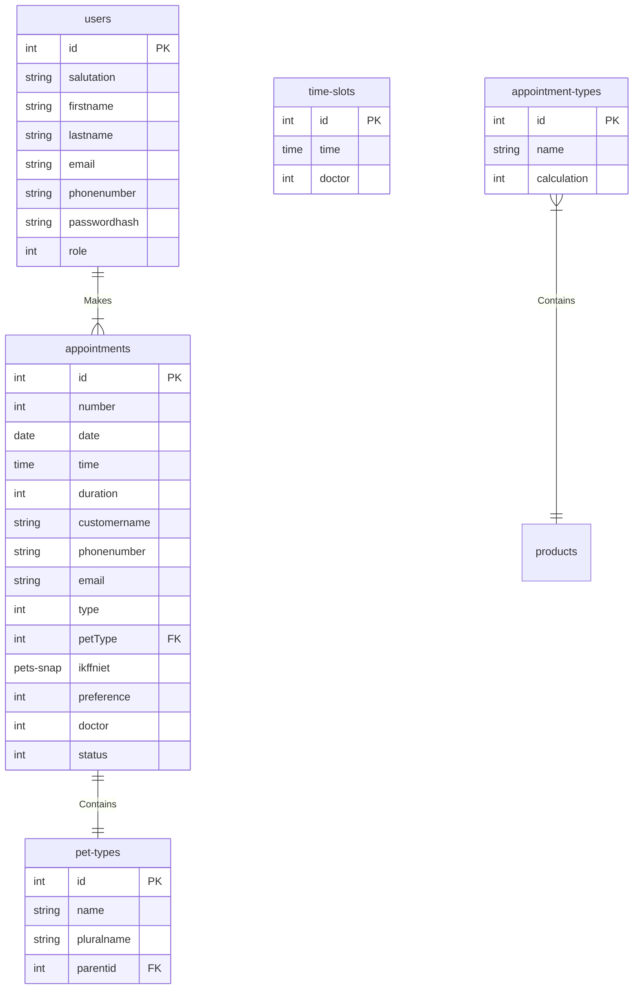

```mermaid
erDiagram
    appointments ||--|| pet-types : Contains
    appointments {
        int    id        PK
        int number
        date date
        time time
        int duration
        string customername
        string phonenumber
        string email
        int type
        int petType     FK
        pets-snap ikffniet
        int preference 
        int doctor
        int status
    }    
    pet-types
    pet-types {
        int    id                PK
        string name           
        string pluralname 
        int parentid FK
    } 

    appointment-types }|--|| products : Contains
    appointment-types {
        int    id                PK
        string name
        int calculation 
    } 

    time-slots {
        int    id                PK
        time time
        int doctor    
    }

    users ||--|{ appointments : Makes
    users {
    int    id                PK
    string salutation
    string firstname
    string lastname
    string email
    string phonenumber
    string passwordhash
    int role
    }
```
