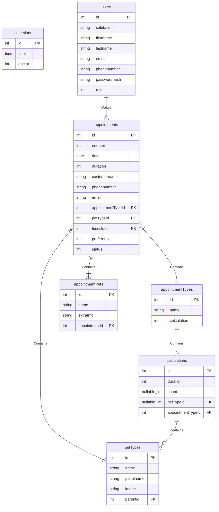

```mermaid
erDiagram
    appointments }|--|| petTypes : Contains
    appointments }|--|| appointmentTypes : Contains
    appointments ||--|{ appointmentPets : Contains
    appointments {
        int    id        PK
        int number
        date date
        int duration
        string customername
        string phonenumber
        string email
        int appointmentTypeId      FK
        int petTypeId              FK       
        int timeslotId FK
        int preference 
        int status
    }    
    petTypes
    petTypes {
        int    id                PK
        string name           
        string pluralname 
        string image
        int parentid FK
    } 

    appointmentTypes ||--|{ calculations : Contains
    appointmentTypes {
        int    id                PK
        string name
        int calculation 
    } 

    time-slots {
        int    id                PK
        time time
        int doctor    
    }

    users ||--|{ appointments : Makes
    users {
        int    id                PK
        string salutation
        string firstname
        string lastname
        string email
        string phonenumber
        string passwordhash
        int role
    }

    appointmentPets {
        int id          PK
        string name
        string extraInfo
        int appointmentId FK
    }

    calculations ||--o{ petTypes : contains 
    calculations {
        int id              PK
        int duration
        nullable_int count
        nullable_int petTypeId         FK
        int appointmentTypeId          FK
    }
```